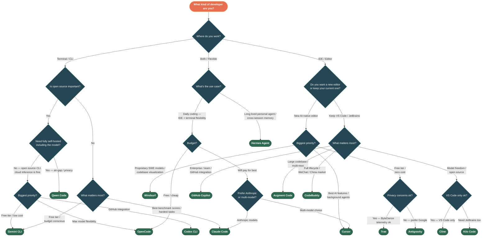

# Decision Diagram: Choosing an AI Coding Tool
**May 3, 2026**

## Flowchart

## Quick Reference

Can't follow the diagram? Start here:

| If you... | Use |
|---|---|
| Want the best autonomous agent, cost no object | **Claude Code** |
| Live in the terminal, want open source + free | **Gemini CLI** |
| Live in the terminal, want max model choice | **OpenCode** |
| Want the most polished AI IDE experience | **Cursor** |
| Want an AI IDE with proprietary SWE models | **Windsurf** |
| Want a free AI IDE and accept ByteDance telemetry | **Trae** |
| Want a free AI IDE from Google | **Antigravity** |
| Already use VS Code/JetBrains, want the market leader | **GitHub Copilot** |
| Want open-source extension, model freedom, VS Code | **Cline** |
| Want open-source extension + JetBrains support | **Kilo Code** |
| Have a massive multi-repo enterprise codebase | **Augment Code** |
| Need full lifecycle + WeChat ecosystem | **CodeBuddy** |
| Need fully self-hosted, air-gapped, open-weight models | **Qwen Code** |
| Want GitHub-native automation (issue → PR) | **Codex** |
| Want a long-lived personal agent with memory | **Hermes Agent** |
